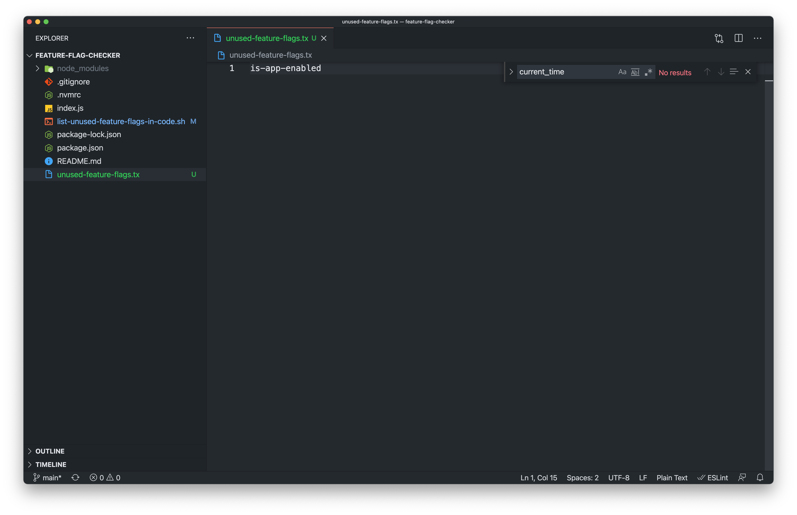

> TL;DR; You can start using [list-unused-feature-flags-in-code.sh](https://gist.github.com/willmendesneto/16acc56846f97603b269e460f84c4445) script in your project using LaunchDarkly and you will get a list of feature-flags to be removed. Also, feel free to check the [GitHub repository "feature-flag-checker"](https://github.com/willmendesneto/feature-flag-checker) to see the demo in action. 🎉

## Introduction

[Feature flag (or feature toggle)](https://martinfowler.com/bliki/FeatureToggle.html) is a common concept, having different ways to integrate that into your project. 

> At the current time this post is written [LaunchDarkly](https://launchdarkly.com/) is one of the most famous platforms in market for feature flags management.

### Creating some standards for feature flag usage to help with their deletion in a near future

Feature flags are quite useful and should have a time-to-live. Standards and patterns are always your friend during this journey.

To make it easier, let's define some ettiquete for feature flags usage among your codebase.

#### Every features should be released under a feature flag

That is a great catch. Every time you can use a feature flag to release a new feature, a large refactor in your codebase or even a transition between services, API's or a third-party integration.

That way, you'll be able to apply some [progressive rollout](https://instabug.com/blog/progressive-mobile-app-release-process/) on these changes, rolling them back if necessary.

#### Feature flags should start with a falsy value

This is a simple and straightforward rule. That's probably the reason why it's so hard to maintain in large codebases. Make sure you have some automation to validate that will be followed across your project.

There are several benefits in keep this rule. One of them is the ability to apply [progressive rollout](https://instabug.com/blog/progressive-mobile-app-release-process/) for your feature flags. Which means that every feature flag return `true` for all your users after a specific time range are also good candidates to be removed.

> Feature flag management platforms are also points of failure. Make sure you are minimizing the risks involved on this integration, in case of an error, timeout or any other issue that might impact your project.

The key point here of having them with a falsy value by definition is the mindset involved in this approach. Having them as `false` means they will be disabled by default. So, in case of any issue during communication with the feature flag management platform, these features will be disabled for your customers.

However, the project will be up-and-running and reliability is the key at this stage. So you can work to understand what's happening and your application is still available for your users, just without the specific new feature/migration/refactory.

<hr />

### Defining cleanup constraints for feature flags

The first draft of that should cover few things. To keep it simple and short, let's focus on 2 topics:
- Feature flags deletion criteria
- Codebase cleanup criteria

#### 1. Feature flags deletion criteria

At this stage, the feature flag should be removed from the feature flag management platform if is turned on for 1 or more days - up to the team/tribe/triad/company to define. After this stage, we can raise a ticket, send a message to the team responsible for that or any other approach that makes sense the most, focusing on the reality in your organization.

#### 2. Codebase cleanup criteria

This will start as soon as the feature flag has been turned on for all the users of your app. Being more specific, after a time range your company determine as relevant or as soon as the feature was released and your team has confidence in removing it.

As soon as the feature flag release reaches the cutt-off time pre-defined, you are able to remove the feature flag from your codebase safely. After that, you might be able to remove the feature flag from the platform safely.

<hr />

### Creating a LaunchDarkly Feature Flags and API keys

> You might need to create a [LaunchDarkly](https://launchdarkly.com/) account as a prerequisite for the next steps

<hr />

[LaunchDarkly](https://launchdarkly.com/) is one of the most famous platforms in market for feature flags management. So, make sure you have a LaunchDarkly account. 

At first, let's create a project in LaunchDarkly. Projects are great to define boundaries between feature flags in different applications. 

In your account, create a project and copy the SDK value. That will be required for our code in NodeJS. You can find the SDK key for your specific project in https://app.launchdarkly.com/settings/projects


Let's add a alias name for our token and call it as `TEST_TOKEN` for now. This will be used only for reference.


So, inside the project we created we can now create our first feature flag. At this stage, let's create a feature flag and call it as `is-app-enabled`. Nothing else will be changes, so let's keep the default configuration as it is for now.


Now let's create a code that will consume the feature flags for this project.

### Running a code using LaunchDarkly and checking for feature flags

Let's write some code! 💻 First let's create a new project by running the command `npm init -y`.

`gist:willmendesneto/fa5a3771487c6d9d89c1034a38456257`

After that, let's install the package `launchdarkly-node-server-sdk`, which is the LaunchDarkly SDK for NodeJS. So that, we can check if a specific feature flag is turned on of off via code.

`gist:willmendesneto/ad38ff87ac239c8bdc625ffd79d70092`

With the dependency installed, let's create a file `index.js`. In this file, we will start a LaunchDarkly connection and check for the feature flag we created - in this case, `is-app-enabled`. So it will check if the feature is enabled or disabled, print the content and stop the process right after that.

`gist:willmendesneto/507831b892fdf0e8836eb0e139f636bb`

As you might noticed, the code requires `LD_SDK_KEY` to be passed. You'll find this value on the project settings of your project.

A small change needs to be applied in our `package.json` in order to have a better experience to run this code. So let's create a NPM script to start the project. 

`gist:willmendesneto/19971882328aec7dd34ff5eed2329441`

When you run the project by calling `LD_SDK_KEY=<your-launchdarkly-sdk-key> npm start`, you might be able to see this output in your console.


### Checking for unused feature flags in your project

Now let's focus on the code that will cover the cleanup requirements we defined previously in this article. The mechanics in the scripts are simple at this stage.

The script will receive a LaunchDarkly API key to make a call to get all the feature flags available per project and environment. With these information it can make a request to get all the feature flags and filter to return the ones turned on for all the users for more than 1 day.

So this filtered list of feature flags will be checked in your repository to see if it exists or not. If it's still in your codebase, they are some good candidates to be removed.

So, this is added in the script called `list-unused-feature-flags-in-code.sh`.

`gist:willmendesneto/16acc56846f97603b269e460f84c4445`

You can check all the available params by running the command passing --help

```bash
npm run list-unused-feature-flags-in-code -- --help
```

Some of the params are optional. However, --token and --project are mandatory.

```bash
npm run list-unused-feature-flags-in-code -- \
  -p=<launchdarkly-project-name> \
  -e=<lauchdarkly-environment> \
  -l=<lauchdarkly-api-limit> \
  -o=<output-file> \
  -t=<your-lauchdarkly-api-sdk>
```

E.G.

> Replace <your-lauchdarkly-api-sdk> with a valid API token. You can find more details about it in https://docs.launchdarkly.com/home/account-security/api-access-tokens

```bash
npm run list-unused-feature-flags-in-code -- \
  -p=feature-flag-checker \
  -e=production \
  -l=3000 \
  -o=unused-feature-flags.txt \
  -t=<your-lauchdarkly-api-sdk>
```

At the end you will have this results on the file with name predetermined and passed in your code (in our case, `unused-feature-flags.txt`).



And voila! All done 🎉 Now you have a list of all feature flags that can be safely removed from your launchdarkly instance. That could be because you're using them for some A/B test validation or even validating a release using progressive rollout to do so. In any case, a great cleanup in your feature flag platform is always good, isn't it? And it might also save some money of your company 😉

Jokes aside, this is just an idea of things you can do to make the maintenance of large codebases smooth. You can evolve this script to do more things, such as create a time-to-live for feature flags in your codebase or anything else that makes sense for your aplication. The ideas are limitless, up to you and your team to decide!

If you want to check the final result of this code, feel free to check the [project "feature-flag-checker" on my Github](https://github.com/willmendesneto/feature-flag-checker).

<hr/>

### That’s all for now

I hope you enjoyed this reading as much as I enjoyed writing it. Thank you so much for reading until the end and see you soon!

🚀🚀🚀🚀🚀🚀

<hr />

### Cya 👋
