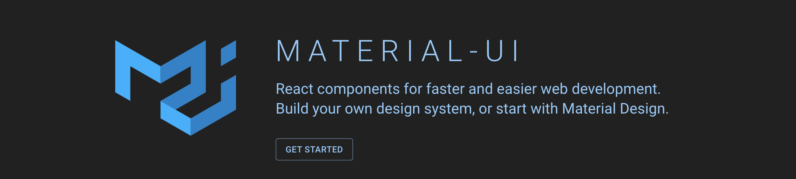
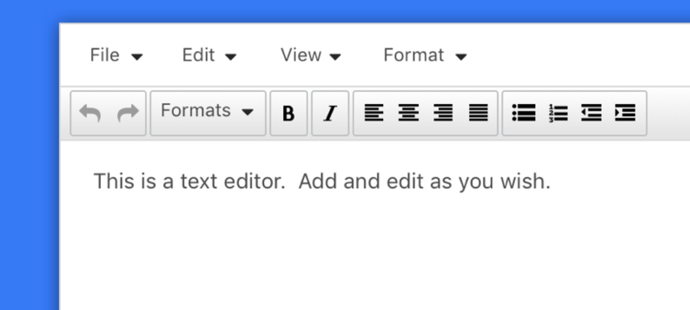
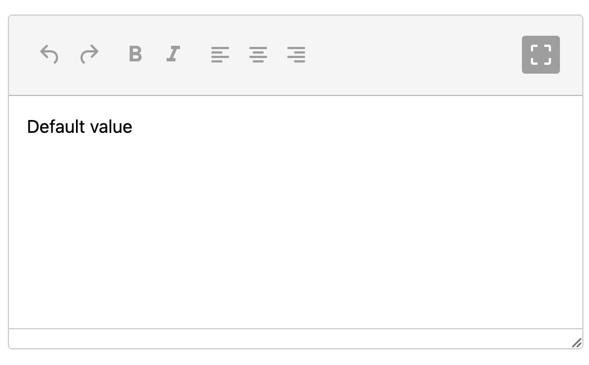

> TL;DR; You can check this code example in action and play with the code in real-time by accessing [this StackBlitz with the example](https://stackblitz.com/edit/tinymce-react-wrapper?file=src%2Ftinymce%2Ficons.js).! 🎉

## Introduction

A design system is a collection of reusable components, having clear standards that can be assembled together to compose any number of applications. 

There are several design systems available, but today I'll be focusing at [Material Design](https://material.io/design/introduction). Material Design is a Design System developed in 2014 by Google and is very popular for web and mobile applications. It has some inspiration by the physical world and its textures, including how they reflect light and cast shadows. Material surfaces reimagine the mediums of paper and ink.

At this time I'll be fosucing at [Material-UI](https://material-ui.com/), a package that enable building your own design system using it as a foundation, or start with Material Design directly in React apps. However, there are several other ways to integrate material design in your app, in case you're not using React.

## Styling your WYSIWYG editor

As soon as you're creating your own Design System you might face some common components to apply some specific styling, such as Graphs, dashboards or Editors. For the case of it, you should first choose the library you should pick, having some constraints that might be relevant for your application.

In case of "What You See Is What You Get" - A.K.A. WYSIWYG - Editors, which are text editors that gives the user the ability of edit some text, add images, align content, add links and more, one of the most common editors is [TinyMCE](https://www.tiny.cloud/docs/quick-start/).

> Choose the best tool for your app is something crucial. I strongly recommend you to check all the pros and cons before choose for a library

Usually, it comes with some common features and styles. Also it has a powerful setup since it's a VanillaJS package. It also has a wrapper in React in order to help your React app. But how can you create a specific theme for your app? What if you need to add some specific feature based on your application needs? Here comes some bad news... 😔

At the moment I'm writing this post the React package is quite simple. It has some common setup for bootstrap and that's all. In addition of the setup, it supports some of the functions that are quite relevant for editor's manipulation, but it doesn't have a good integration via React, neither for Material-UI package.

On the other hand, there are some great news. Since it's a wrapper, you can always go to their documentation - and they have a massive documentation across their own docs and other websites, blog posts and StackOverflow answers. So here it goes some tips to get you covered! 🎉

### Defining a component architecture for your Editor

Firstly, let's create a component's architecture for the common editor requirements. Initially, it needs to cover few things such as:

- icons: a place for editor icons, in case you want to create new toolbar actions or even override the default icons
- editor: Editor's initialisation and default configuration
- theming: styles for a specific theme for your editor. Extremely useful in case of shared components across multiple applications, brands, etc. 

Having these constraints in mind, the folder structure will be something like this.

`gist:willmendesneto/511305067938b86f6e77f3ad414e1296`

### Creating a Material UI component to wrap the theme of your Editor

Now let's write our components. The first one will have all the defaults for editor's initialisation, initial text value and a callback to be called when the editor content has some changes.

`gist:willmendesneto/d6f3873dc45bfe9a1f0640389e5bdd40`

After that, the second component will wrap all the styling structure of your editor inside your application. For that we can use `withStyles` High-Order Component - HOC - helper wrapping a common component (in this case I'm using `Grid`, but feel free to use the one that makes more sense for your project).

Bear in mind that WYSiWYG editors are often with default classes and styles. So we can reuse the classes and override their styles. This is an example sharing how to increase toolbar styles, changing colors, border-radius, and more. Another good point of that: there are also some changes on the last toolbar list of items. This will be interesting to make sure the last list of items are *always* on the right, it doesn't matter what.

So this will be the component wrapping the theme styles of your editor. You can always create other wrappers and define the usage on the consumer side.

`gist:willmendesneto/e2b49cdb6a6dccb90d800a20887c2185`

The last file to be covered in this section will have all the icons that will be used in the editor.

`gist:willmendesneto/399d49972e870819ca75b86c2d0c51c4`

Having all these changes in place, this is the first result of your theme that will be used in your Editor. 🎉🎉

### Creating a toolbar action for your Editor

As a next step of our Editor integration, we should also be able to create new actions inside the editor. This is relevant for your customers since it enhances the editor by empowering new features inside the editor and improving the user experience in your product.

To enable that, TinyMCE integration has a `setup` function that can be passed on as component configuration. This function receives the editor instance inside the callback, giving your app the flexibility to add, update and remove items, add toolbar actions, disable specific features and more. These method are very well documented on TinyMCE official documentation.

Let's create a new case in our app to elaborate a real scenario in an app. The app will have a maximize and minimize actions. 

So, when the user clicks on maximize, it will trigger an action to maximize the editor and change the icon to minimize and vice-versa. Another good point to keep in mind is that this should be configurable, not having anything coupled across the different app brands and products.  

How these requirements can be covered? In our case, we will create a new prop called `onSetupActions` that will receive some specific configuration for actions, icons and buttons on the consumer side.

So, at the end the component will receive these props as configuration and it will make the icons and toolbar actions available. These actions will be added and/or removed based on the toolbar configuration.

`gist:willmendesneto/b67a43ca5cd83a678e02e22521c25ae6`

This configuration passed via `onSetupActions` will be used on the Editor component by calling `editor.ui.registry.addIcon` in case of adding and/overriding an icon in your application and `editor.ui.registry.addToggleButton` if you the prop has some configuration for add a new toolbar action.

`gist:willmendesneto/0c3d7aea32e6f4342afd794e0a9be366`

As you can see, the component is now flexible, easy to maintain and following the design and feature specs as we defiined. All set and done! ✅

## The results

As a final result, your app will have a single place with the source of your WYSIWYG editor code: styles, features, wrappers and icons all in a single. Also, it has all the flexibility in case you might come up with new requirements 🎉 

Feel free to check the example in real time, change the code, and more on [the StackBlitz code sample](https://stackblitz.com/edit/tinymce-react-wrapper?file=src%2Ftinymce%2Ficons.js).

> Material-UI + TinyMCE = 🤩

### That’s all for now

I hope you enjoyed this reading as much as I enjoyed writing it. Thank you so much for reading until the end and see you soon!

🚀🚀🚀🚀🚀🚀

### Cya 👋
