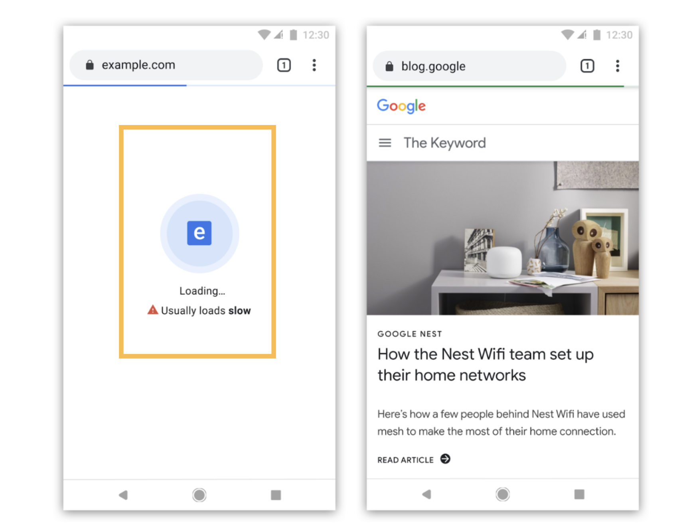

> TL;DR; You can start using [Perf-Marks](https://github.com/willmendesneto/perf-marks) package in your Frontend (Angular, React, VueJS, Svelte, Ember among others) and Backend apps right now and get the built-in performance, lightweight, isomorphic integration, and a simple and smooth developer experience benefits. Support the project by starring the Github repository and enjoy! 🎉

\*\* Feel free to play with the online demos powered by Stackblitz [**https://stackblitz.com/edit/perf-marks-playground**](https://stackblitz.com/edit/perf-marks-playground)

## Introduction

Performance bottleneck is a common problem to be facing when working in large frontend application? Problems like memory leaks, and functions having high consume of memory can be real issues in your site and there are some other features there are really useful to improve the performance of your web app... but what if it’s not enough?

Also it's good to mention that browsers such as [Google Chrome will identify and label slow websites](https://techcrunch.com/2019/11/11/google-chrome-to-identify-and-label-slow-websites/). That means that performance is not just papercut, having an important role in your website.

> Performance is not papercut, this is and always will be about user experience as well.

## Defining baselines for performance measurement

Making your web app blazing fast 🚀 is crucial for user experience purposes. At first step to improve that, is by identifying and measuring where time is being spent across your pages. 

At first you can use common metrics such as page load errors or high memory consuption due to Long tasks running in your browser. In that case, you can use a [Long Task API](https://developer.mozilla.org/en-US/docs/Web/API/Long_Tasks_API).

### Rail Model

The experimental Long Tasks API gives us visibility into tasks that take 50 milliseconds or more. The 50 ms threshold comes from the [RAIL Model](https://web.dev/rail/), in particular the "[Response: process events in under 50 ms](https://web.dev/rail/#response)" section. These tasks that are blocking the main thread for 50 ms or more can raise issues such as delays on "Time to interactive" metric, High/variable input and event handling latency or even janky animations and scrolling in your project.

`gist:willmendesneto/f9b7fc1a1800badf7e24136ccca3af75`

> You can find more details about the RAIL Model [on the Web.Dev page for the Model](https://web.dev/rail/)
For that, you can cont on [User Timing API](https://web.dev/user-timings/)

### Core Web Vitals

Another metric that can be used is called Core Web Vitals. Web Vitals is an initiative by Google to provide unified guidance for quality signals that are essential to delivering a great user experience on the web. 

The current set is focuses on 3 aspects of the user: _experience—loading, interactivity, and visual stability_, including some thresholds.

## Measure User Experience instead of technologies

Of course, these are some of the metrics you can use as baseline for your measurement. In combination of that, you can use some techniques to improve the numbers that you analyse from your instrumentation, such as:

- Setting performance budget
- async load components
- critical path management
- optimistic preloading

But the question still persists. What if we *missed* something? Which metric is the best for my app? This is something that will always come up, it can be because of unique scenario your app is facing or something else. For critical situations like that, a common suggestion is to track the user experience instead of technology.

> Not sure? Just don't measure technology

At the end, the user won't know anything about Javascript Frameworks, CSS, Client-side or server-side rendering.

On the other hand, they will know if your website image is using async load and it's taking more than 2 seconds to be visible. This might affect their experience drastically! 

## User Timing API and performance measures

[User Timing API](https://web.dev/user-timings/) is an important API if you want to measure performance in your Javascript API’s, components, and pages. It allows the developer to create application specific timestamps that are part of the browser's performance timeline. There are two types of user defined timing event types: the `mark` event type and the `measure` event type.

These events are named by the instrumented application and can be set at any location in an application. measure events are also named by the application but they are placed between two marks thus they are effectively a midpoint between two marks. You can access those data from JavaScript using the API or by viewing them on your [Chrome DevTools Timeline Recordings](https://developer.chrome.com/docs/devtools/evaluate-performance/reference/) and in your [reports via Lighthouse Audition](https://developers.google.com/web/tools/lighthouse/).

## Simplifying User Timing API dev experience across Frontend and Backend with Perf-Marks package

Even though we have all built-in support for us to instrument and measure our pages and API's, their integrations are quite different between frontend and backend. It means that they don't have the same Developer Experience - aka DX - between isomorphic applications using Javascript! As an example, this is a simple code showing how to integrate User Timing API on the backend side in a NodeJS application.

`gist:willmendesneto/c0abc2a0c8d0ced80c94fde7ac73e44e`

To solve this and other problems like having a common API between Backend and Frontend, with full support for intrumentation in isomorphic applications and more I created the package called [Perf-Marks](https://github.com/willmendesneto/perf-marks).

[Perf-Marks](https://github.com/willmendesneto/perf-marks) is the isomorphic, simplest, and lightweight solution for User Timing API in Javascript - 🚀 only 208B 🚀. Tree-shaking and entry points built-in. Simple as that!

### Bundle and package size matters

Bundle and package sizes are always important and this is something to keep in mind when thinking about this module.

The module supports multiple animations, themes, supports for better web accessibility and more feature with an impressive bundle size of **208B** and the package has **140kB** to be installed in an application 🎉

### Easy entry points integration to avoid increase in your bundle

By using Perf-Marks you can easily instrument your Frontend Apps, components, libraries and API's without any friction. The integration is the same between layers and it also follows some best practices.

Instead of load all the package methods, you can import what you need via entry points and avoid your app the load unnecessary code at that moment. This example shows how to measure a specific method by exporting perf-marks `profiler()` function via `perf-marks/profiler` entry point.

`gist:willmendesneto/41985f16808602e62510f3c994edebbc`

### Smooth integration between Frontend and Backend

All the logic to manage the integration between frontend and backend, client-side and server-side is handled by perf-marks. So your developers should have confidence on their instrumentation by simply doing something like this! Easy peasy, lemon squeezy 🍋!

`gist:willmendesneto/5b82b65ef17877b59c7434e9d495eb8d`

### Flexible ways to measure what matters in your app

You might also measure things like A/B Testing time to load, interactions and user journey! For example, how long the users are interacting with your galleries, how long your API is responding some data to your consumers or how long your Frontend Application located in one AWS Region is taking to upload some files to a distinct AWS region, understand the delays and solve that in advance, in a proactive way!

### That’s all for now

Stay tuned because this is not the end, it's just the beginning. Let's keep building awesome stuff and have some **#fun** 🚀

I hope you enjoyed this reading as much as I enjoyed writing it. Thank you so much for reading until the end and see you soon!

### Cya 👋
