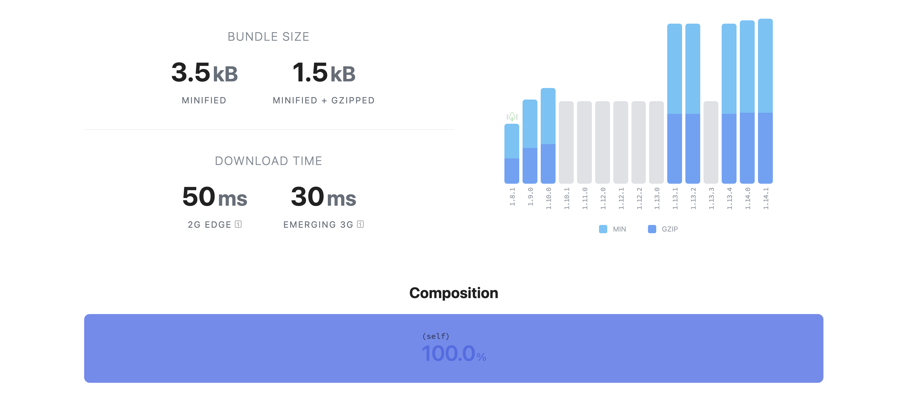

## Introduction

Among the evolution or large codebases, concerns about performance are always raised. That might be by different techniques: [dynamic async imports](https://developer.mozilla.org/en-US/docs/Web/JavaScript/Reference/Statements/import#dynamic_imports), defining [Critical Resource, Critical Path Length and Critical Bytes](https://developers.google.com/web/fundamentals/performance/critical-rendering-path/analyzing-crp), lazy loading images via [libraries](https://web.dev/lazy-loading-images/) or by [using the browser-level image lazy-loading support](https://web.dev/browser-level-image-lazy-loading/) and so on and so forth.

Even though these are quite good ideas, having application performance boost as final results, it's usually done on the application side. If you're using design system and javascript libraries you should also care about their bundle sizes. 

> Some of these points were covered on ["Solving a problem is more than just adding a new dependency"](https://willmendesneto.com/posts/solving-a-problem-is-more-than-just-adding-a-new-dependency) post. The intention of this post is specifically to show you how to integrate entry points in your NPM Packages.

### The problem with large Javascript bundle size

Even with the advent of HTTP2, prefetch, preload and parallelization, content minified, uglified and compressed, the bundle issue still persists. The bright side of it is that's a common solution and there are several ways to solve that.

For some applications this is more than enough, covering several scenarios that might affect the performance of your app. However, these approaches are focused on the file after-bundle procress, not covering usage before-bundle.

For scenarios like libraries, frameworks or design systems, having several components being shared across multiples pages and components of your project is a huge problem. Even having tree-shaking suport for your bundler, the algorithm is not covering all the cases.

For example, if you have a design system on the namespace `@myapp/` and you have a button which imports some icons, you'll ending up having `@myapp/buttons` and `@myapp/icons` in your dependencies. Also, if your build distribution is sharing only CommonJS, you might have all the buttons and icons. And it's even worse, because CommonJS not tree-shakable! 😱

To ilustrate this scenario, let's imagine you have 2 components in your `@myapp/buttons` package. From now on you'll have `Button` and `ButtonWithIcon` and there are several components inside `@myapp/icons` -  it can be more than 30 components, for example.

`gist:willmendesneto/4790ece61053fbbcd00f121e6cdb4313`

Even knowing I'm using a single button and a single icon, how can I solve the problem of have all these unused components on the final bundle of my project? 

### Distributing ESM and CommonJS in your bundles to have tree-shaking support

First of all, you should make sure that all your components are having *at least* CommonJS and ESM in your bundle distribution. So that you can expose the different bundles in your `package.json`. ESM will be exposed on `modules` and commonjs will be exposed on `main` fields, respectively.

In a 100% ESM module world, identifying side effects is an easy job. However, we aren't there just yet, so in the mean time it's necessary to provide hints to webpack's compiler on the "pureness" of your code.

> If you want to know more about side-effects, why they're required and the impact in your app, please read the [Webpack's tree-shaking docs page](https://webpack.js.org/guides/tree-shaking/#mark-the-file-as-side-effect-free)

With all these changes in place, the first version of your `package.json` will be like that.

`gist:willmendesneto/85aa95888267e6c889a36850dda82b82`

Now it's time to have all the benefits of tree-shaking and reduce the bundle size of your app.

### Code-Splitting and taking advantage of tree-shaking by reduce bundle size

Your `@myapp/buttons` package will have the build distribution organized that way.

`gist:willmendesneto/7cacd4cef0a978a4b3193159dc6642e2`

Your bundler will try to use ESM before CommonJS in order to avoid bundle increase. So it knows if your package has any ESM bundle by checking `module` field in your `package.json`.

You can notice that if you import the package using `import Button from '@myapp/buttons/esm/Button.js` that will work. 

However, this is not ideal since you're coupling your app with the internal code structure of your dependency. This will raise massive issues with common tasks, such as update a package dependecy.

Now that your application knows too much about the dependency directories, that might also implies breaking changes in case of dependency structure changes as well. In summary, it means that if for some reason the build distribution was changed and now it's in `@myapp/buttons/dist/esm/Button.js` you have a broken app!

> You should not access your dependency directories directly, unless it's something *extremelly* necessary. A small change in your dependencies and your app might be broken

`gist:willmendesneto/f10a675c29dc89c79f1c12d794bb9285`

### Package Conditional Exports and Creating Declarative Entry-Points in your package.json

Let's make a quick recap before jump in this topic. Now we know that ESM is a tree-shakable distribution format and we can have the benefits by using it. We also know that we shouldn't access the package files directly by navigating through the dependency structure.

Keeping these points in mind, one way to solve is by using an entrypoint structure. Entry-points is a way to expose a specific function, class or component intentionally to be consumed to your users. So that, the consumers can only import a specific piece of code instead of all the functions of the used dependency, enabling bundle decrease and having a better understanding of what's being used in your app. 

This architecture is called ["Package Conditional Exports"](https://nodejs.org/docs/latest-v12.x/api/packages.html#packages_conditional_exports) - AKA "Package Entry-Points" - and some packages such as lodash and others are using this technique to decouple their functions, so their consumers can export only what's needed for them.

The idea here is to install all the package functions, but delay the decision of which function is required on development time. On lodash case, it add some benefits. So it won't be needed to install `lodash.compact`, `lodash.debounce` and other packages one by one since you can access them via entry-points via `lodash/compact` and `lodash/debounce`, respectively.

On the case of our `@myapp/buttons`, we can achieve the same idea by exposing entry-points in folders on the root project. Each folder will have a `package.json` with the specified configuration for it. This is great for your app and avoids breaking changes in case of code structure.

Even though this solves the problem, have a robust way to expose a set of functions if needed is something that's always useful. To have that in place easily, we can create a folder called `entrypoints`. The folder will have the entrypoints defined by files and, more than this, by features.

If you need a specific entry point to expose more than 1 component, that can be done easily by the file. In this case, 2 new components were added in `@myapp/buttons`: `ButtonGroup` and `ButtonTheme`. 

Instead of creating a entry-point for each of the files, a new entry-point calledn `@myapp/buttons/utils` was created, giving the choice of export each of them to the app consumer.

`gist:willmendesneto/fc59e6e69cdba23c4ec12fcc7555f97a`

Based on that specific case, the package json inside of `@myapp/buttons/utils` folder will be 

`gist:willmendesneto/22594cb79f8fe89b7769e502ebb1ac92`

With these changes applied, that will be the structure of your package, supporting entry-points 🤘🤘🤘🤘

`gist:willmendesneto/beaf9b570766245d3ca3d64372bc2a77`

### Better Entry-Points support on NPM in a near future

As you might have noticed, entry-points are a massive help to decrease the bundle of your application, giving your more flexibility in your app, being easy to integrate - and also to remove, having a massive role in other performance initiatives, such as code-splitting, if necessary.

A lot of heavy-used packages are using it such as [date-fns](https://date-fns.org/), [Lodash](https://lodash.com/) and Design Systems such as [Atlaskit](https://atlaskit.atlassian.com/) are also using it - 🤩 I'm really glad to add the [first support for entry-points in this Design System](https://bitbucket.org/atlassian/atlaskit-mk-2/pull-requests/3639/code-splitting-components-and-exposing/diff), in specific 🤩 - , having huge performance gains before-bundle and before deployment to production.

This technique is getting so much traction that a even better way to integrate them into your app is being defined by NPM. And - spoiler alert - the support will be built-in, in your `package.json`.

> You can find more details about `Package Conditional Exports` on ["Modules: Packages" NPM Documentation page](https://nodejs.org/docs/latest-v12.x/api/packages.html#packages_conditional_exports)

I encourage you to see all of these steps in action by using [perf-marks entry-points](https://github.com/willmendesneto/perf-marks#entrypoints) in your application. It's a cross-platform performance measurement package powered by User Timing API and it has a simple and straightforward usage.

> You can find more details about Perf-Marks on ["Cross-platform performance measurements with User Timing API and perf-marks"](https://willmendesneto.com/posts/cross-platform-performance-measurements-with-user-timing-apiand-perf-marks/) post.

### That’s all for now

I hope you enjoyed this reading as much as I enjoyed writing it. Thank you so much for reading until the end and see you soon!

### Cya 👋
