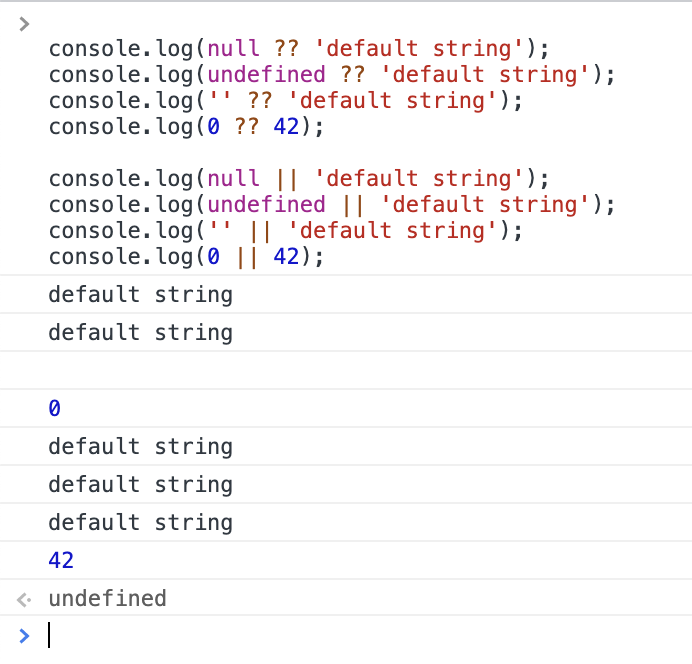
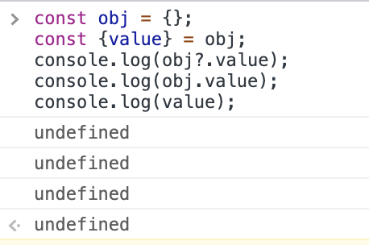

## Introduction

This will be a quick tip about [Nullish Coalescing operator](https://developer.mozilla.org/en-US/docs/Web/JavaScript/Reference/Operators/Nullish_coalescing_operator) and [Optional chaining](https://developer.mozilla.org/en-US/docs/Web/JavaScript/Reference/Operators/Optional_chaining) I just raised few weeks ago [in this Tweet](https://twitter.com/willmendesneto/status/1402687604471078912). The nullish coalescing operator (`??`) is a logical operator that returns the assigned value in case of the check is done in a variable/attribute with value as `null` or `undefined`.

It's definitely such great operator (in specifically if you had the pleasure to work with Coffeescript or similars) and it's way cleaner than some other approaches, but there are also some small caveats to be aware. For example, in a comparison of nullish coalescing (`??`) and or (`||`) operators the app will get different results since `||` will check for falsy values, which includes empty strings and the number 0, in the example below.

Optional chaining is also great! It was something the developers were looking for (coming from coff, coff, coffeescript 🤣) for such long time. A real case is when you need to check if the object has that attribute. 

One thing to be aware about these operators though is how this is transpiled at the moment. If you are using Typescript and/or Babel in your app, you should be very conscious about the output code.

Let's imagine you have a simple function, like the one described below, in your app. This output will be suboptimal on bundle process. 

`gist:willmendesneto/407c4076df3d98a04be95bf455a83172`

If you take a look at the TypeScript output of this code, you’ll see the bundle difference between the approach using or and nullish coalescence ... it’s a huge difference! [Here a link for a playground in case you want to check the code and the output in a live example](https://www.typescriptlang.org/play?#code/GYVwdgxgLglg9mABAcwKZQMIODZAKAWAChFTEJtcB+ALkQG9iznEBDAB3dVYCdXJUtRAGcoPGGGQBuJi1L8YAW1awEQ0eMkyScxABs4rACYTkAFVQAPKOrGntu8nHA26YEIoBGqHg91QAC1RFQTp6AG0AazoNUwBdOn4ATwBfRAAfRHc9PT9SFOIASjoANzgYIwZZUgowUQYOLl5+CFREAF5EAHI9CVQugBo2MCUVeCROrvYeOGQeVGFhQcRA4LbO7L0hg2NTC2sO7oAZQxNJADpL5YoXQ4BGNM7anGQMzPoU7WqnOrg9VHOBnwjW4fAEQwUylUYCGqxC21OeysUCGNzAUEK2gKRGIoEg0JQ6CwYBeACZCDoapRkEJGJSWCDmgJbJppN9mJCxmoYnYtOyyDszuZkSz7PyqS4hO4vD48iw4aEGFEeayEsNUhksiAcnLscVEGUKlV6bV6oywa1Ds9qOdzS02lQqN1emB+nLTVBhqMCU9qVRbSMoeNEI7utNZvNFl13Qh6gqrX7zvHQ5sY3VPYKkQdfSSbZnJPtPaGuiddhcrmn6mjPTmXv7qyGnXcvibY38AUC8HbwV6gwhYUF4fpEQXkajnOjMcRsbjwNBg2hMNSAMwU5jWmlhcVsTig+2ivn0jmBrlgA9so8CkfC6znuXrieuLUy3zbhW05UiXnINXJNKZVNvj1UpykqOkH3TBpdyZS1JhdfoIRPH0wxmOYFiWAc1kOTYETLG8a2Oa9LnOa5H3uR4fheRsGE+YhvlNdtAVmLtoItVBEO9cZMKHfN8PHFwpyIFIgA)

In this case, you could be using [destructuring assignment](https://developer.mozilla.org/en-US/docs/Web/JavaScript/Reference/Operators/Destructuring_assignment), default values, or even the `||` operator. This will decrease your bundle a bunch, decrease the bundle of your function and you'll have exactly the same legibility in your code as using other approaches.

Also, be mindful when adding these checks in your code linting of your project. This would be encouraged by some rules and they might need to be revisited in a near future.

### That’s all for now

For sure Nullish Coalescing operator is amazing, but you need to be aware of the pros and cons in your app in regards of topics such as bundle size, page load, and web performance.

I hope you enjoyed this reading as much as I enjoyed writing it. Thank you so much for reading until the end and see you soon!

🚀🚀🚀🚀🚀🚀

### Cya 👋
