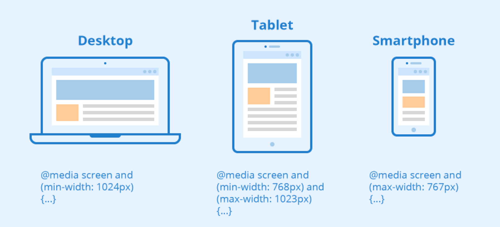
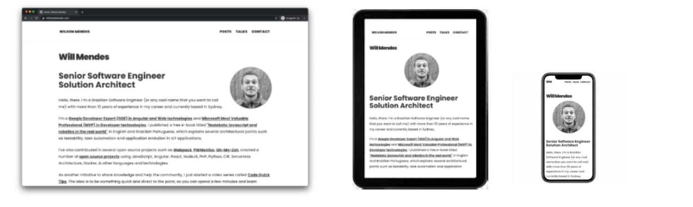

## Introduction

Usually, when you have to create components in your frontend app you have to cover different views in several devices, with different screens and sizes. CSS Media Queries - `@media` - were created to make this process easier. There are several ways ot organize your CSS using well known techniques, such as [BEM](http://getbem.com/), [SMACSS](http://smacss.com/) and [OOCSS](http://oocss.org/) to avoid css rules clashing and changing different components across your page.

## The problem

However, that's not what happens in some applications - which is unfortunately. In order to solve problems like more control of CSS global rules changing the default behaviour of your component, breaking changes in your style dependencies by creating boundaries betwen your component and styles related to the same and other issues you might face in your app that CSS-In-JS came as a great solution.

Easy integration and styles encapsulation were the key sellpoints for CSS-In-JS usage across web projects. As always, everytime we look for a different way to solve a problem, we might also find another set of problems to be solved and an easy media query management in monorepo/multirepo codebases was a trending topic for such long time.

Several libraries are recommended by different CSS-In-JS solutions, such as:
- `@emotion/core`: recommends [facepaint](https://emotion.sh/docs/media-queries#facepaint) A lightweight package to manage breakpoints
- `styled-components`: recommends the old and gold `@media` used directly via string, [like on the example added on their docs](https://styled-components.com/docs/api#supported-css)

... and you can find different ideas - usually _way too complex_ - to be used in combination of those packages in a quick search at Google. They won't scale in a small project and lead your team to a massive headache and continue into a architectural erosion in medium and large codebases.

## Using CSS Media Queries for Responsive Apps

To make this process smooth as possible, with fast feedback, I just created a small, but totally useful Gist that covers the integration of CSS Media Queries! *Easy to maintain* and evolve, *mobile-first* beforehand and with 🤩 *less than 11 lines of code* 🤩 - and that does the job 😉.

This script is not covering all scenarios, like [Twitter Bootstrap breakpoints helper](https://getbootstrap.com/docs/5.0/layout/breakpoints/) or [@include-media](https://eduardoboucas.github.io/include-media/) solutions by purpose. The main reason to avoid that at first step is:

> Premature optimization is the root of all evil

Yes! For loads of applications this small script will solve all the scalability issues and it's so simple to evolve that you can have a single place to have specific logics for scenarios when you have to use something more complex, such as [Element Queries](https://www.smashingmagazine.com/2016/07/how-i-ended-up-with-element-queries-and-how-you-can-use-them-today/), for example.

`gist:willmendesneto/fc4b5537f3712e3bd3d2e32f4731dacb`

## The results

As a final result, your app will have a single place as the source of your breakpoints, without any needs of matchMedia listeners and other complex API's at the first step, unless they're really needed. 

As I mentioned in another post, dependencies are necessary in webapps. However, [we should consider twice when adding any package dependency in our apps for several reasons](https://willmendesneto.com/posts/solving-a-problem-is-more-than-just-adding-a-new-dependency).

### That’s all for now

This was a quick one, but I hope you enjoyed this reading as much as I enjoyed writing it. Thank you so much for reading until the end and see you soon!

### Cya 👋
