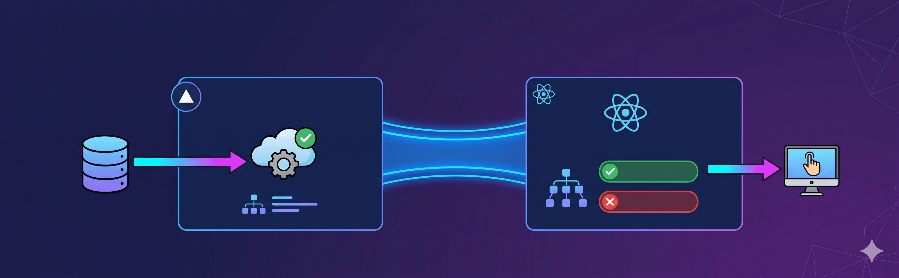

> TL;DR; Use Vercel Flags SDK on the server to evaluate `NEXT_PUBLIC_FEATURE_FLAG_*` keys, pass the resolved map to `FeatureToggleProvider` from `reactor-feature-toggle` in the root layout, and read flag state anywhere in your React app with `useFeatureToggle().isOn(...)` on the client or `await isFeatureEnabled(...)` on the server. No flag value is ever computed twice. 🎉

### Introduction

Feature flags are one of those tools that feel straightforward right up to the moment your app straddles two runtimes. In a Next.js App Router project you have Server Components doing data fetching, API route handlers running on the edge, and React client components managing interactivity — all of them potentially need to know whether a flag is on or off, and all of them live in very different execution contexts.

The naive solution is to pick a single evaluation point and live with the trade-offs. Either you evaluate on the server and hydrate the result down as props (fragile, ad-hoc), or you evaluate on the client and accept a flash of the wrong UI state. Neither is great.

This post walks through a pattern that solves it cleanly: **Vercel Flags SDK handles remote evaluation on the server, and `reactor-feature-toggle` distributes those resolved values to every client component through a single React context**. The server computes flag state once; the client never needs to phone home to re-evaluate.

---

### Why two libraries?

[Vercel Flags](https://vercel.com/docs/flags) is a platform feature. It gives you remote flag management with per-environment overrides, a toolbar for preview deployments, and a typed SDK that integrates with Next.js `flag()` and `flags/next`. What it does not do is manage how those values flow through your React tree on the client side.

[`reactor-feature-toggle`](https://www.npmjs.com/package/reactor-feature-toggle) is a lightweight React library that covers exactly that gap: a provider + hook pattern that lets any client component read flag state without prop drilling or redundant fetches.

The combination is clean. Vercel Flags owns the *decision*; `reactor-feature-toggle` owns the *distribution*.

---

### Step 1 — Create the flags in the Vercel dashboard

Before any code, create each flag in your project's Vercel Flags UI. The key there should be **kebab-case** and match the suffix of your env var in lowercase:

| Env var | Vercel Flags key |
|---------|-----------------|
| `NEXT_PUBLIC_FEATURE_FLAG_CHECKOUT_V2` | `checkout-v2` |
| `NEXT_PUBLIC_FEATURE_FLAG_AI_RECOMMENDATIONS` | `ai-recommendations` |

You can also pull the current flag values locally after linking the project:

```bash
npx vercel link
npm run vercel:flags        # list remote flags
npm run vercel:env-pull     # pull FLAGS, FLAGS_SECRET, NEXT_PUBLIC_FEATURE_FLAG_* into .env
```

This is a required step, not optional. If the flag doesn't exist in the dashboard, remote evaluation has nothing to resolve and your env-variable fallback carries all the weight.

---

### Step 2 — Declare env vars with Zod validation

All flag keys live in a single validated env module. Using `t3-env` or a similar Zod-based setup, each key is declared as a string enum that defaults to `"false"`:

```typescript
// src/env.mjs
export const env = createEnv({
  shared: {
    // ... other keys
    NEXT_PUBLIC_FEATURE_FLAG_CHECKOUT_V2:
      z.enum(["true", "false"]).optional().default("false"),
    NEXT_PUBLIC_FEATURE_FLAG_AI_RECOMMENDATIONS:
      z.enum(["true", "false"]).optional().default("false"),
  },
  runtimeEnv: {
    NEXT_PUBLIC_FEATURE_FLAG_CHECKOUT_V2:
      process.env.NEXT_PUBLIC_FEATURE_FLAG_CHECKOUT_V2,
    NEXT_PUBLIC_FEATURE_FLAG_AI_RECOMMENDATIONS:
      process.env.NEXT_PUBLIC_FEATURE_FLAG_AI_RECOMMENDATIONS,
  },
});
```

Every flag defaults to `"false"`. This is intentional: if the deployment is missing the env var or the remote evaluation fails, the feature stays off. It keeps partial deploys and rollbacks safe.

---

### Step 3 — The server evaluation layer

This is the core of the pattern. A server-only module wraps each flag with `flag()` from `flags/next`, wires the Vercel adapter, and provides two env-fallback escape hatches — one for local development and one for failures at runtime.

```typescript
// src/utils/feature-toggle-server.ts
import { vercelAdapter } from "@flags-sdk/vercel";
import { flag } from "flags/next";
import { env } from "@/env.mjs";

const vercelAdapterInstance = vercelAdapter();

const isLocalEnvironment =
  env.VERCEL_ENV === "development" ||
  env.NODE_ENV === "development" ||
  env.NODE_ENV === "test";

function createBooleanAppFlag(vercelKey: string, envKey: FeatureFlagEnvKeys) {
  // In local/test: read env directly, no remote call needed.
  if (isLocalEnvironment) {
    return (_req?: FeatureFlagEvaluationRequest) =>
      Boolean(env[envKey] === "true");
  }

  const decide = async (params) => {
    try {
      const raw = await vercelAdapterInstance.decide({
        key: vercelKey,
        headers: params.headers,
        cookies: params.cookies,
        entities: params.entities,
        defaultValue: false,
      });
      return Boolean(raw);
    } catch {
      // Vercel Flags unreachable — fall back to the env var for this deployment.
      return env[envKey] === "true";
    }
  };

  return flag<boolean, boolean>({
    key: vercelKey,
    adapter: vercelAdapterInstance,
    decide,
  });
}

export const appFeatureFlags = {
  NEXT_PUBLIC_FEATURE_FLAG_CHECKOUT_V2: createBooleanAppFlag(
    "checkout-v2",
    "NEXT_PUBLIC_FEATURE_FLAG_CHECKOUT_V2"
  ),
  NEXT_PUBLIC_FEATURE_FLAG_AI_RECOMMENDATIONS: createBooleanAppFlag(
    "ai-recommendations",
    "NEXT_PUBLIC_FEATURE_FLAG_AI_RECOMMENDATIONS"
  ),
} as const;
```

Two public functions are exported from this module:

```typescript
// Evaluate a single flag — pass { request } in route handlers
export async function isFeatureEnabled(
  featureName: FeatureFlagKeys,
  options?: IsFeatureEnabledOptions
): Promise<boolean> { ... }

// Evaluate all flags at once — used by the root layout
export async function getFeatureToggles(
  request?: FeatureFlagEvaluationRequest
): Promise<AppFeatureToggles> { ... }
```

> **Important:** this module must never be imported from client components. `flags/next` uses `next/headers` internally, which is only available in Server Components and route handlers.

---

### Step 4 — Root layout: evaluate once, provide everywhere

The root layout is the right place to resolve all flags for the current request. The resolved map becomes the initial value for `FeatureToggleProvider`:

```typescript
// src/app/layout.tsx
import { FeatureToggleProvider } from "reactor-feature-toggle/client";
import { getFeatureToggles } from "@/utils/feature-toggle-server";
import { cookies } from "next/headers";

export default async function RootLayout({
  children,
}: {
  children: React.ReactNode;
}) {
  // Await cookies() first so the layout segment is cookie-dynamic.
  // flags/next reads the `vercel-flag-overrides` cookie for Toolbar overrides
  // on Preview deployments. Skipping this causes overrides to be silently ignored.
  await cookies();

  const featureToggles = await getFeatureToggles();

  return (
    <html lang="en">
      <body>
        <FeatureToggleProvider featureToggleService={featureToggles}>
          {children}
        </FeatureToggleProvider>
      </body>
    </html>
  );
}
```

One call, one network round-trip to Vercel Flags, all values cached for the lifetime of the request. Every client component in the tree gets the same resolved state without any additional fetching.

The `await cookies()` line deserves a comment. On Vercel Preview, the Toolbar stores per-session flag overrides in an encrypted `vercel-flag-overrides` cookie. If you skip `await cookies()`, Next.js may not mark the layout as dynamic before `getFeatureToggles()` runs, and the cookie store won't be available — so your toolbar overrides silently lose to the remote dashboard values. Awaiting `cookies()` first forces the correct behaviour.

---

### Step 5 — Reading flags in client components

Any client component under the provider reads flags through the `useFeatureToggle` hook:

```typescript
"use client";
import { useFeatureToggle } from "reactor-feature-toggle/client";

export function ProductRecommendations() {
  const { isOn } = useFeatureToggle();
  const isAIRecommendationsEnabled = isOn("NEXT_PUBLIC_FEATURE_FLAG_AI_RECOMMENDATIONS");

  if (!isAIRecommendationsEnabled) return null;

  return <RecommendationPanel title="You might also like" />;
}
```

No async work, no waterfall, no state management. The values were resolved on the server during SSR, serialised into the React tree via `FeatureToggleProvider`, and are now synchronously available on the client.

---

### Step 6 — Reading flags in server-only code

For Server Components, route handlers, or middleware, use `isFeatureEnabled` directly:

```typescript
// Page-level gating (Server Component)
import { isFeatureEnabled } from "@/utils/feature-toggle-server";
import CheckoutV2 from "@/components/checkout/CheckoutV2";
import CheckoutLegacy from "@/components/checkout/CheckoutLegacy";

export default async function CheckoutPage() {
  const isCheckoutV2Enabled = await isFeatureEnabled(
    "NEXT_PUBLIC_FEATURE_FLAG_CHECKOUT_V2"
  );

  return isCheckoutV2Enabled ? <CheckoutV2 /> : <CheckoutLegacy />;
}
```

For API route handlers, pass the `NextRequest` so the Vercel adapter can read cookies and headers for per-request toolbar overrides:

```typescript
// Route handler
import { isFeatureEnabled } from "@/utils/feature-toggle-server";

export async function GET(request: NextRequest) {
  const isEnabled = await isFeatureEnabled(
    "NEXT_PUBLIC_FEATURE_FLAG_AI_RECOMMENDATIONS",
    { request }
  );

  if (!isEnabled) {
    return NextResponse.json({ recommendations: [] });
  }

  const recommendations = await fetchAIRecommendations(request);
  return NextResponse.json({ recommendations });
}
```

---

### The evaluation chain: local, preview, production

One of the things that makes this pattern practical is that the evaluation logic adapts to the environment automatically:

| Environment | How flags are resolved |
|-------------|------------------------|
| `next dev` / unit tests (`NODE_ENV === "test"`) | Env vars only — no remote call, no Vercel billing. Fast feedback loop. |
| Vercel Preview (normal browser traffic) | Vercel Flags SDK first. Toolbar override cookie wins if present. Env var fallback if the adapter fails. |
| Vercel Preview + automation traffic (valid `x-automation` header) | Env vars only — same as local dev, so E2E, synthetic tests, and internal scripts match the deployment's vars rather than user-scoped rollouts. |
| Vercel Production | Vercel Flags SDK first, then env var fallback on any failure. |

The env-var fallback on remote failure matters more than it sounds. Feature flag platforms are external dependencies. If the Vercel Flags adapter returns a network error mid-deploy or during an incident, your app keeps running with the values baked into the deployment. The feature stays in whatever state the deployment was configured for — not in an unpredictable half-open state.

> Feature flag management platforms are also points of failure. Make sure you are minimising the risks involved in this integration, in case of an error, timeout or any other issue that might impact your project.

---

### Adding a new flag

The full checklist for adding a flag:

1. **Vercel dashboard** — create the key (`dark-mode`) in the project's flags UI.
2. **`src/env.mjs`** — add `NEXT_PUBLIC_FEATURE_FLAG_DARK_MODE` to both `runtimeEnv` and the Zod schema with `.default("false")`.
3. **`src/utils/feature-toggle-server.ts`** — add an entry to `appFeatureFlags`:

```typescript
NEXT_PUBLIC_FEATURE_FLAG_DARK_MODE: createBooleanAppFlag(
  "dark-mode",
  "NEXT_PUBLIC_FEATURE_FLAG_DARK_MODE"
),
```

4. **Consume it** — either `useFeatureToggle().isOn(...)` in a client component or `await isFeatureEnabled(...)` in a server context.

TypeScript takes care of the rest. Because `AppFeatureFlagKeys` is inferred from `appFeatureFlags`, passing an unknown key to `isFeatureEnabled` or `isOn` is a compile-time error.

---

### Testing

**Client components:** wrap the component under test with `FeatureToggleProvider` and pass explicit booleans. No mocking of the library itself needed.

```typescript
import { FeatureToggleProvider } from "reactor-feature-toggle/client";
import { render, screen } from "@testing-library/react";
import { ProductRecommendations } from "./ProductRecommendations";

it("renders the recommendation panel when the flag is on", () => {
  render(
    <FeatureToggleProvider
      featureToggleService={{
        NEXT_PUBLIC_FEATURE_FLAG_AI_RECOMMENDATIONS: true,
      }}
    >
      <ProductRecommendations />
    </FeatureToggleProvider>
  );

  expect(screen.getByText(/you might also like/i)).toBeInTheDocument();
});

it("renders nothing when the flag is off", () => {
  const { container } = render(
    <FeatureToggleProvider
      featureToggleService={{
        NEXT_PUBLIC_FEATURE_FLAG_AI_RECOMMENDATIONS: false,
      }}
    >
      <ProductRecommendations />
    </FeatureToggleProvider>
  );

  expect(container).toBeEmptyDOMElement();
});
```

**Server utilities:** override the env vars in the test process before importing the module. A small helper that mutates `process.env` (and resets it in `afterEach`) works well here.

```typescript
import { setEnvOverrides, resetEnvOverrides } from "~/test/mocks/env";

afterEach(() => resetEnvOverrides());

it("returns true when the env var is set", async () => {
  setEnvOverrides({ NEXT_PUBLIC_FEATURE_FLAG_CHECKOUT_V2: "true" });
  const result = await isFeatureEnabled("NEXT_PUBLIC_FEATURE_FLAG_CHECKOUT_V2");
  expect(result).toBe(true);
});

it("returns false by default", async () => {
  const result = await isFeatureEnabled("NEXT_PUBLIC_FEATURE_FLAG_CHECKOUT_V2");
  expect(result).toBe(false);
});
```

---

### What this gives you

Stepping back, the value of this combination is not just that it works — it is that it gives you a consistent model across the whole app:

- One source of truth for flag definitions (`appFeatureFlags`)
- One source of truth for env validation (`env.mjs`)
- One evaluation point per request (root layout for UI, route handlers for API)
- One reading API for client code (`useFeatureToggle().isOn(...)`)
- Automatic env fallback so the platform is never a single point of failure

Feature flags are meant to reduce risk. The implementation of the flag system itself should not introduce any.

### That's all for now

I hope you enjoyed this reading as much as I enjoyed writing it. Thank you so much for reading until the end and see you soon!

🚀🚀🚀🚀🚀🚀

<hr />

### Cya 👋
