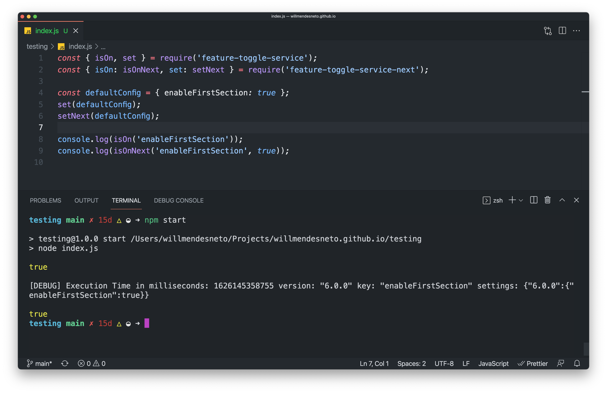

## Introduction

There are some really known patterns to migrate packages in large applications. You might find some code referencing to a different package (such as `@my-namespace/my-package/next`) or specific branches (like `@my-namespace/my-package#next`). All of this is applied in order to mitigate risks during this migration. So you can use a common architectural practice focused on having the project evolution in steps called [Strangler pattern](https://martinfowler.com/bliki/StranglerFigApplication.html), having both packages in use until the previous usage is totally removed from the codebase.

However, we can make it really simple to be done in some cases by adding different package names pointing to the same package.


## Using an old and the latest version of the package in the same project

> Please make sure you are using Node Version >=10.16.0 and NPM version >=6.9.0 in your repository or it won't work as expected

Firstly, let's create the project to show a real example of this approach in action. In order to start, let's first create a folder called `multiple-package-versions-in-project` and, inside of this folder, initialize a node project by running `npm init -y`.

After that, we can install the old and latest versions of the package. The package used in this example is `feature-toggle-service`, a lightweight package to manage feature toggle in your app.

You can have it done directly via NPM! What will be done in this case is to use an idea called "package aliases" by using this pattern on the install command:

```bash
npm install <package-name-alias>@npm:<package-name>
# Or if you want to point on a specific version
npm install <package-name-alias>@npm:<package-name>@<package-version>
```

In your example, we'll call `feature-toggle-service` when using the old version of the package and `feature-toggle-service-next` when using the latest version. At the end, this will be the commands you have to run to get the setup done in your local environment.

```bash
# Creating folder jumping on the created folder
mkdir multiple-package-versions-in-project && \
cd multiple-package-versions-in-project \
# Starting a NPM project
npm init -y && \
# Installing old & new versions of `feature-toggle-service` package
npm install --save \
  feature-toggle-service@npm:feature-toggle-service@4.0.0 \
  feature-toggle-service-next@npm:feature-toggle-service@6.0.0
```

As you can see on the code below, your `package.json` file now is pointing to different versions of the same package, having that available calling their respective aliases by calling via `import` or `require`.

```json
{
  "name": "multiple-versions-of-package-in-project",
  "version": "1.0.0",
  "description": "Using multiple versions of the same package in a project",
  "main": "index.js",
  "scripts": {
    "start": "node index.js"
  },
  "keywords": [],
  "author": "Will Mendes <willmendesneto@gmail.com>",
  "license": "ISC",
  "dependencies": {
    "feature-toggle-service": "npm:feature-toggle-service@^4.0.0",
    "feature-toggle-service-next": "npm:feature-toggle-service@^6.0.0"
  }
}
```

<hr/>

Now, let's write some code using these packages. This can be done by importing both packages and methods and printing their outputs by passing their values in `console.log()` functions.

```js
onst { isOn, set } = require('feature-toggle-service');
const { isOn: isOnNext, set: setNext } = require('feature-toggle-service-next');

const defaultConfig = { enableFirstSection: true };
set(defaultConfig);
setNext(defaultConfig);

// ❌ Old version: does NOT have a `debug` option
console.log(isOn('enableFirstSection'));
// ✅ Latest version: does have a `debug` option available
console.log(isOnNext('enableFirstSection', true));
```

In this case, we have a new feature on `isOn` method on the latest version, which is the only one who has `debug` option.

Also, you can check in your Editor/IDE that their JSDocs are totally different as well. It confirms that the package aliases are up and running in your project.


At the end, this will be the output when you run the code by calling `npm start` or `node index.js`.




<hr/>

The code is quite simple, but the idea is not at all. In fact, this will become quite handy if you need to migrate and/or upgrade packages with several major versions bumped. This will avoid your webapp to face issues in potential due to breaking changes affecting core features, lack of backward compatibilities - which is expected in major packages bumps - and so on, and so forth.

<hr/>

### That’s all for now

I hope you enjoyed this reading as much as I enjoyed writing it. Thank you so much for reading until the end and see you soon!

🚀🚀🚀🚀🚀🚀

<hr />

### Cya 👋
