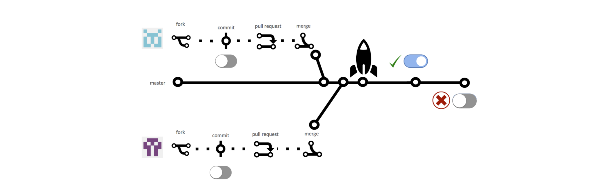

> TL;DR; You can start using [NGX Feature Toggle](http://bit.ly/ngx-feature-toggle) module in your Angular apps right now and get the built-in performance, flexibility and extensibility benefits. Support the project by starring the Github repository and enjoy! 🎉

<hr />

\*\* Feel free to play with the online demos powered by Stackblitz [**https://stackblitz.com/edit/ngx-skeleton-loader-sample**](https://stackblitz.com/edit/ngx-skeleton-loader-sample)

### Introduction

Feature Toggle is a common concept in software development. You might also find this content covered with other names, such as _Feature Flags_ or mixed/combined with other concepts, such as _Feature Business_. Even though these are different names and perhaps, integrated in different scenarios, they have its roots on the same core concept: *release early, release often*.

> Being empathetic over being right is the key sometimes ❤️

Keep in mind this crucial concept: anything, absolutely *anything* in software development is documented, created and integrated based on release product improvements in any level to customers as quick as possible without compromising user experience and platform relieability. Development experience, Accessibility, Performance and such are there with this goal. It also means that anything that might not be helpful or can make this a painful process should be revisited.

### Problem statement in Frontend

Let's start with the first question related to that level of integration, which is:

> Why using a module, package or library instead solve it via server-side rendering?

The idea of this - and any other - module is to bring transparency and flexibility to this step as much as possible. So the main point is integrate this module with other level of tooling, process, such as:

- Server-side rendering;
- Progressive rendering;
- Integration with third-party platforms, such as Launchdarkly, among others;
- Any other that you like :)

As an example, you can integrate with WebSockets or handling this in a EventSourcing architecture. It's totally transparent for you and you can integrate easier in your application.

At the end, NGX Feature Toggle is covering the scenarios related to Angular, the framework, not the core concepts which are - and for few scenarios should not - be covered by such integration.

### Using Feature Toggles to improve Leading time

Feature toggle is a good approach to integrate your teams with a different mindset, moving towards continuous deployment applications. With that, you can still ship features that require other integrations in different layers of your app or even turn off some experimental feature in case of production issues.

So that, several applications running in different environments, such as web, mobile, embedded and others, can now have their code shipped with even more confidence and avoiding long issues running in production when they could just be something turned off via code.

### Toggles x Business: Understanding the scenarios

Therefore you might find these 2 concepts mixed across apps, it's good - and totally worth it - to know the difference conceptually.

Feature Toggle is totally about delivery. In a scenario of a new feature, for example, you should define the release strategy. It should cover different things, but in summary releasing features should cover these points:

- Feature should have definition of success. It can be error rates, user conversion, etc.;
- Feature should be implemented having in mind it's feature toggles to be turned on/off during the ship process;
- Feature should be released to all application environments. This new features should be released turned off by default, having this value changed per environment after release strategy validation;
- Feature should be tested and turned on in test environment. It can be for a specific list of team members or for everyone using the test environment;
- Feature should be released to production environments following the release process. It can be all or nothing approach (like turning on the feature for every single user) or using progressive rollout until reach all customers;
- Feature toggle should be removed after all the checks have passed and integration is working as expected in production;

Good to keep in mind that every single feature toggle should have time-to-live. It means they will be removed after release and having the feature running in production with success after some predefined timeframe.

<hr />

On the other hand, Feature Business are more related to features that need to be enabled in some specific and predefined time range. A good example of that are related to some specific features you can find in e-commerce apps during Black Friday or any other sales they're promoting to their customers. These feature flags won't be removed and they're totally connected to the business rules related to the application's domain. Of course there's more, but that's the main difference between them in its core.

### NGX-Feature Toggle: Components, Directives And Route Guards

Specifically about `NGX-Feature-Toggle` library, some decisions were applied to make this process smooth, adding even more benefits for consumers which are using it. As an example, instead of exposing services and enforce integrations with specific libraries such as RXJS, Signals, and others, everything is a component.

It means that this management level can be done using different approaches, adding flexibility to the released code and another level of possibilities and integrations to consumers!

Here's a list of components and directives you might find available on `NGX-Feature-Toggle` library:

- `feature-toggle-provider`: Handle with feature toggle configuration in your application. It adds the default values of your enabled/disabled features;
- `*featureToggle`: Directive that handles with feature toggle check. So that, the component will be rendered/removed based on the feature toggle configuration is enabled;
- `*featureToggleWhenDisabled`: Directive that handles with feature toggle check. So that, the component will be rendered/removed when the feature toggle configuration is disabled;

And here's a sample showing the components and directives in action.

```typescript
import { Component } from '@angular/core';

@Component({
  selector: 'component-docs',
  template: `
    <feature-toggle-provider [features]="featureToggleData">
      <div *featureToggle="'enableSecondText'">
        <p>condition is true and "featureToggle" is enabled.</p>
      </div>
      <div *featureToggle="'enableFirstText'">
        <p>condition is false and "featureToggle" is disabled. In that case this content should not be rendered.</p>
      </div>
      <div *featureToggle="'!enableFirstText'">
        <p>
          condition is false and "featureToggle" is disabled
          <b>but it has "!" as a prefix of the feature toggle to be checked.</b>
          In that case this content should be rendered.
        </p>
      </div>
      <div
        class="combined-feature-toggles-with-truthly-option"
        *featureToggle="['!enableFirstText', 'enableSecondText']"
      >
        <p>
          This is a combined condition. It shows if <b>enableSecondText</b> is true and <b>enableFirstText</b> is falsy,
          but it has "!" as a prefix. If both cases are correct, then the "featureToggle" is enabled and rendering this
          component.
        </p>
      </div>
    </feature-toggle-provider>
  `,
})
export class ComponentDocsComponent {
  public featureToggleData: {
    [k: string]: boolean;
  } = {
    enableFirstText: false,
    enableSecondText: true,
  };
  // ...
}
```

<hr />

In some scenarios when you need to prevent the route to be loaded, you can use `NgxFeatureToggleCanLoadGuard`, by passing the class and configuration of the feature toggle to be checked in your route data.

You might have some specific requirements that you should redirect a user to a specific route in case of a feature flag is disabled. For that, you can use `redirectTo` as a mechanism to redirect a user in a specific route when it tries to access in a route with a `CanActivate`/`CanActivateChild`/`CanLoad` Feature Toggle Guard and the feature toggle is disabled.

For advanced scenarios you can use a combination of route guards AND redirects. E.G.

```js
...
export const routes: Routes = [
  {
    path: 'customer',
    component: CustomerComponent,
    canLoad: [NgxFeatureToggleRouteGuard],
    canActivate: [NgxFeatureToggleRouteGuard],
    canActivateChild: [NgxFeatureToggleRouteGuard],
    // This is the featureToggle configuration for
    // the parent component
    data: {
      featureToggle: ['enableCustomerPage'],
      // If feature toggle is disabled, the user will be redirected to `/error` URL
      redirectTo: '/error'
    },
    children: [
      {
        path: ':id',
        component: CustomerDetailComponent,
        // This is the featureToggle configuration for
        // the child component. It can also use
        // a combination of feature toggles
        data: {
          featureToggle: ['enableCustomerPage', '!enableChildrenNavigation'],
          // If one (or all of them) of the feature toggle is disabled, the user will be redirected to `/customer-error` URL
          // Note that you can use redirects for the main url and their children
          redirectTo: '/customer-error'
        },
      },
    ],
  },
];
...
```

### Bundle and package size matters

Bundle and package sizes are always important and this is something to always keep in mind when thinking about this module.

The module supports routes guards, redirects, component composition, third-party integrations and more feature with an impressive bundle size of 1.69KB and the package has 104kB to be installed in an application. That's massive! 🎉

### That’s all for now

Stay tuned because this is not the end, it's just the beginning. Let's keep building awesome stuff and have **_#ngxFun_** 🚀

I hope you enjoyed this reading as much as I enjoyed writing it. Thank you so much for reading until the end and see you soon!

<hr />

### Cya 👋
