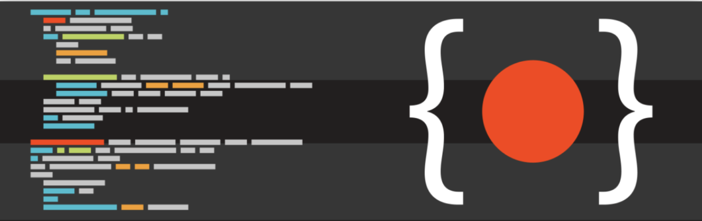
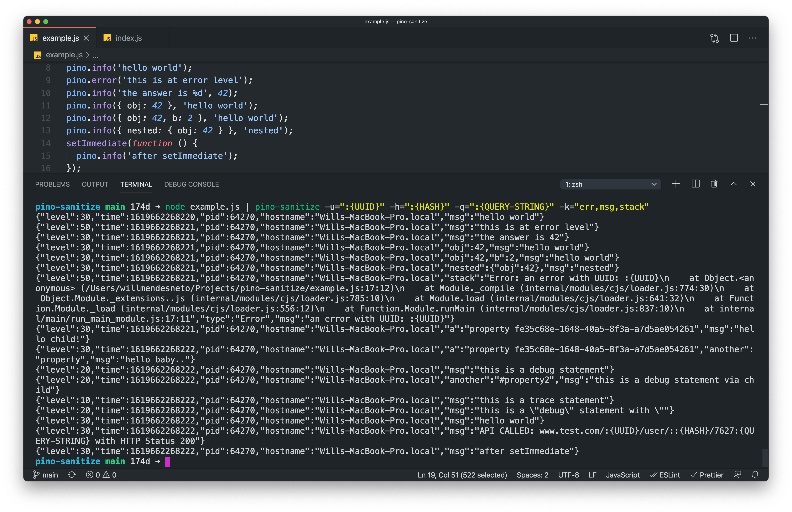

## Introduction

As your project is scaling and used for more customers, your architecture is becoming more spread. This is a common and well known effect, so the ability to monitor logs is essential at this stage.

Have a log support in your project will provide a deeper visibility into application and infrastructure in topics such as performance data, events and errors, and quickly troubleshoot production incidents... and sometimes something that powerful might create other issues to be solved. Let's understand more about these issues.

## The problem with sensitive data in logs

At first, when you're logging sometimes you're not checking all the data inside the log function as payload. So the content can be a string with a text, a simple object or a robust structure - anything that makes sense to you to track or help during your troubleshooting. And that's the main problem.

With the advent of new legislation rules like [General Data Protection Regulation - aka GDPR](https://en.wikipedia.org/wiki/General_Data_Protection_Regulation) or correlate laws, the companies are now responsible with the user's data. And logging is also included and affected by those new rules.

It will require to apply some mechanisms in your log platform to remove the sensitive data stored in there until today. In addition to that, you also need to make sure the current application is not logging any sensitive data. You can apply these changes on the log function that your project is calling to send the information into your logging platform.

However, for safety reasons you might also apply the sanitize and strip data in another level than your application. So that, you are fully covered that any the specified sensitive data won't be added into your logs and your company won't be legally affected by it.

## Solving it before reaching your log platform and the benefits of pino-sanitize

> This example is using `pino-sanitize` and it's focused on NodeJS. However, these concepts can be applied in any other language, tool, framework or platform.

If you have an application using NodeJS you might be using [PinoJS](https://getpino.io), a small a and very low overhead logger for NodeJS applications. It's quite fast, flexible and with a great documentation.

In order to make this process smoothiest as possible by empowering the developers to have plug-and-play solutions to filter logs before transport the info into the logging platform used in your app, PinoJS supports transports.

Transports on the pino package context is a tool that consumes the logs and maniputes the received input, returning a new output with your changes at the end. So I'm glad to share a new package called [pino-sanitize](https://github.com/willmendesneto/pino-sanitize), a PinoJS transport package that sanitizes sensitive data, such as UUID, tokens, and hashes inside some log field.

The usage is quite simple. For this example the package will be installed globally via NPM. 

```bash
npm install -g pino-sanitize
```

After that, just need to add a pipe in your NodeJS script passing `pino-sanitize` and configure with the params that you should be removed from your logs.

```bash
npm start | pino-sanitize
```

The accepted params that can be passed via CLI are

- `--uuid` (`-u`): Filter log removing UUID (defaults to `false`).
- `--hash` (`-h`): Filter log removing HASH (defaults to `false`).
- `--qs` (`-q`): Filter log removing Query Strings (defaults to `false`).
- `--keys` (`-k`): Define which keys should be sanitized (E.G. `-k err,msg`) (defaults to `err,error,msg,message`).

As an example, let's create a file and add some sensitive data into your logs.

`gist:willmendesneto/cd1e4b1e3ae28634b8ab25d00411ca39`

if you have a file like this example here and run the command with the specified params. That's how easy it is to integrate `pino-sanitize` in your application.

`gist:willmendesneto/85a77ac8d9f934123384bbaea7a74eba`

<hr />

So, at the end, this will be the output of your code. Your output won't have the sensitive data in your output. As you can see, there are no sensitive data added into your application logs 🎉🎉



<hr/>

### That’s all for now

I hope you enjoyed this reading as much as I enjoyed writing it. Thank you so much for reading until the end and see you soon!

🚀🚀🚀🚀🚀🚀

<hr />

### Cya 👋
