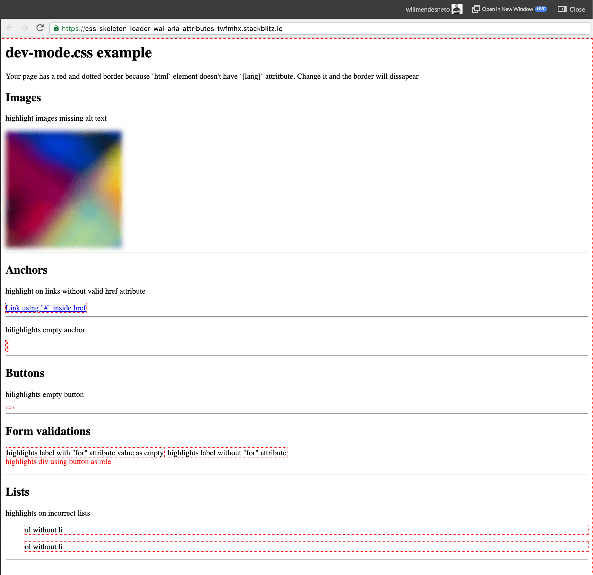

> 🧪 The main goal of this post is to research, trying to find new solutions by adding innovation and improving your dev experience - aka DX. You should have that in mind, exploring a simple and easiest way to have that added in your devloop, without any time friction. 🧪

## The problem

This time I'll share a quick code tip. Usually, when you have to validate Web accessibility in your project you might have to use some tooling, perhaps even run some commands in your tests and/or project pipeline.

> ⚠️ It goes without saying, but every task automation matters. That means this might add some time in your pipeline and/or add maintainance time in your automated tasks. You should also have that, but the idea of this post is explore a simple way to have that added in your devloop, without any time friction.

## Using CSS for Accessibility linting in HTML elements

To make this a smooth process with fast feedback, I just created a small, but totally useful Gist that I called *a11y-dev-mode.css*! It has some CSS rules that applies some changes on elements without correct information such as missing attributes, having elements with empty content and assuming wrong [Accessible Rich Internet Applications Suite — WAI-ARIA](https://www.w3.org/WAI/standards-guidelines/aria/) roles.

`gist:willmendesneto/4302de65ed6fa0e3661d3c0c08cf2a28`

### What "A11Y-Dev-Mode.css" file is checking?

This gist is covering most of the common issues, such as:

- HTML tag `<html>` without `[lang]` definition;
- Ordered/Unordered (`<ol>` and `<ul>`, respectively) HTML lists without a list inside (`<li>`) of them;
- Images (``) without `[alt]` attribute;
- Anchor tags (`<a>`) without correct `[href]` or even empty;
- Label tags without `[for]` attribute;
- Empty `<button>` tags;
- Div tags using `[role="button"]`. It affects some screen readers and browsers, changing the default behaviour of div for people with disabilities;

## The results

As a final result, your page will display elements like this when they're missing some of the mandatory attributes.

As you can see, this is quite useful and you can import the file only in your local development, improving your dev loop and avoiding these issues to be released to production.

🤘 Feel free to play with this example by accessing the [Stackblitz demo for "a11y-dev-mode.css"](https://stackblitz.com/edit/css-skeleton-loader-wai-aria-attributes-twfmhx?file=styles.css). 🤘

> ⚠️ Please keep in mind this should not be published to production since it's a file used only for debugging purposes. Otherwise you might have issues in your website.

### That’s all for now

This was a quick one, but I hope you enjoyed this reading as much as I enjoyed writing it. Thank you so much for reading until the end and see you soon!

### Cya 👋
