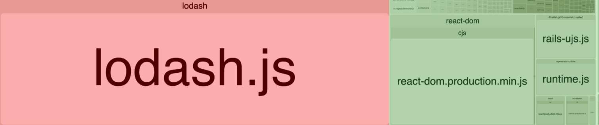

## Introduction

This will be a quick post! Today I'll be sharing how to validate if your project dependency has beem used in your repository. This is a common issue as your project scales and you need to make sure you're not using, installing or even downloading unnecessary dependencies in your local environment, in your CI/CD pipelines or even deploying these packages in your production environment.

### Checking for unused project dependencies with depcheck

To make this a quick process, we can use a NPM package called [depcheck](https://www.npmjs.com/package/depcheck). This package will validate every dependency of your codebase and check if the dependency if you missing to declare some specific dependencies (in order to avoid imports of packages added as transitient dependencies by another dependency of your project) and if the packages have been used or not in your project folder.

### Creating a project to simulate the problem

To create our project inside a folder called `my-project`. Inside this folder, we can run a command `npm init -y`. This command will start a NPM project to be used as an example.

`gist:willmendesneto/fa5a3771487c6d9d89c1034a38456257`

The `package.json` file generated initially for this project won't have any dependencies, neither dev dependencies. As a next step, we'll install a new dev dependency, a NPM package called [perf-marks](https://www.npmjs.com/package/perf-marks) by using the command `npm install perf-marks --save-dev`. 

`gist:willmendesneto/f7e7e1e1c67889ce55461e8da77d06a0`

When the command finishes, you might see a new field called `devDependencies` in your `package.json`. 

`gist:willmendesneto/af151eeb8fcc74b5aa07e0d408087f87`

Now if you run the command `npx depcheck` you might see a message like that, listing `perf-marks` as an unused dependency.

`gist:willmendesneto/da7ad7137f22ac97aeb5623fbe84a42a`

And that's it! 🎉

### Ignoring a dependency in depcheck

In case you want to ignore a specific dependency for some reason, you can do it too! Just need to create a file called `.depcheckrc` at the root of your repository.

In this file, you can add `perf-marks` as a package to be ignored by depcheck validation.

`gist:willmendesneto/01f6e15a547e8ef50d5cab0fcbe76518`

So, in the next time you run `npx depcheck` command, the call should not return any error message.

Also, this is a video I recorded showing how to use `depcheck` package in your project. Enjoy 🤘🤘🤘

### That’s all for now

I hope you enjoyed this reading as much as I enjoyed writing it. Thank you so much for reading until the end and see you soon!

🚀🚀🚀🚀🚀🚀

### Cya 👋
